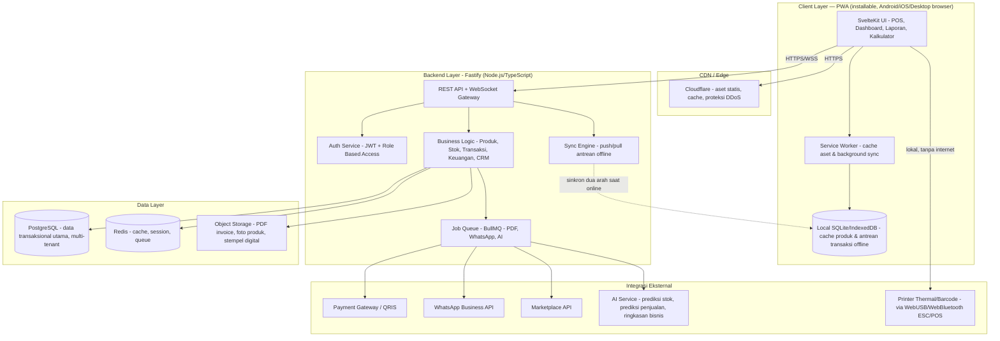
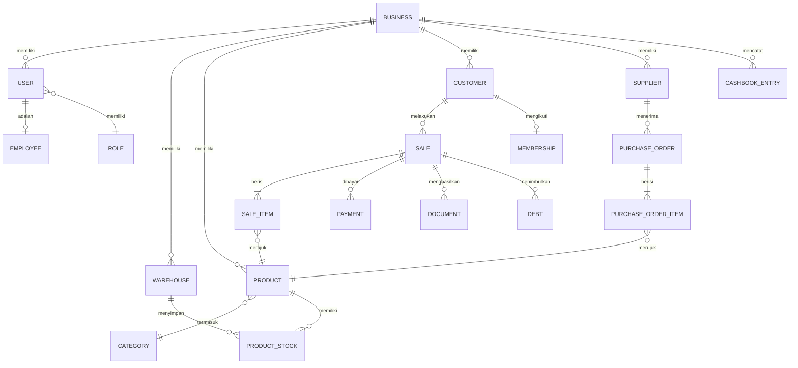

# Technical Specification: All-in-One Tools Administrasi UMKM

**Versi:** 1.0
**Tanggal:** 8 Juli 2026
**Terkait dengan:** PRD All-in-One Tools Administrasi UMKM v1.0
**Status:** Draft

---

## 1. Ringkasan & Prinsip Desain Teknis

Dokumen ini menerjemahkan PRD menjadi keputusan teknis konkret. Prinsip yang memandu semua keputusan di bawah:

1. **Cepat di device rendah** — target pengguna adalah UMKM menengah-ke-bawah yang sering memakai HP Android RAM 2-4GB dengan koneksi 3G/4G tidak stabil. Setiap keputusan stack diuji lewat pertanyaan: "apakah ini menambah beban di HP low-end?"
2. **Offline-tolerant** — kasir tidak boleh berhenti berjualan hanya karena WiFi warung mati.
3. **Satu basis kode, banyak platform** — hindari maintain kode terpisah untuk web dan mobile selama belum benar-benar diperlukan.
4. **Biaya infrastruktur rendah** — margin UMKM tipis, jadi biaya hosting per-tenant harus bisa ditekan.

---

## 2. Keputusan Platform: Web App vs Native App

### 2.1 Rekomendasi: **Progressive Web App (PWA)** sebagai platform utama

| Kriteria | PWA (direkomendasikan) | Native App (Android/iOS terpisah) |
|---|---|---|
| Waktu ke pasar | 1 codebase, lebih cepat | 2-3 codebase (Android/iOS/Web back-office) terpisah |
| Ukuran & instalasi | Instant, tanpa Play Store, update otomatis | Perlu unduh APK/Play Store, update manual |
| Kompatibilitas device rendah | Optimal — browser modern sudah tersedia di HP Android murah | Butuh APK lebih besar, resource lebih berat |
| Offline capability | Bisa penuh via Service Worker + local DB (lihat §4) | Native, tapi effort sama besarnya |
| Akses hardware (printer thermal, kamera barcode) | Bisa via WebUSB/WebBluetooth/WebRTC (browser modern mendukung) | Native API lebih lengkap, tapi selisihnya makin kecil tiap tahun |
| Distribusi ke Play Store (untuk kepercayaan & discovery) | Tidak ada secara default | Ada |
| Biaya development jangka panjang | Rendah (1 tim, 1 basis kode) | Tinggi (butuh tim Android + iOS + web) |

**Keputusan:** Bangun sebagai **PWA installable** (bisa "Add to Home Screen" dan berjalan seperti app native, lengkap dengan ikon, splash screen, dan mode offline). Jika di kemudian hari butuh kehadiran di Play Store untuk kepercayaan pengguna awam, PWA yang sama bisa dibungkus dengan **Capacitor** tanpa menulis ulang UI — jadi ini bukan keputusan yang mengunci kita ke satu jalan.

### 2.2 Kenapa bukan Electron/desktop native untuk kasir?
Electron terlalu berat untuk device rendah (bundle >100MB, konsumsi RAM tinggi) dan tidak dibutuhkan karena kasir UMKM mayoritas berjalan di HP/tablet Android atau laptop dengan browser, bukan aplikasi desktop khusus.

---

## 3. Tech Stack Terpilih

### 3.1 Frontend

| Layer | Pilihan | Alasan |
|---|---|---|
| Framework | **SvelteKit (Svelte 5 / Runes)** | Svelte adalah compiler, bukan library runtime — komponen dikompilasi jadi vanilla JS saat build, sehingga tidak ada overhead virtual DOM di browser. Riset perbandingan 2026 secara konsisten menunjukkan bundle SvelteKit jauh lebih kecil dibanding Next.js pada halaman setara — kisaran umum yang dilaporkan adalah bundle awal SvelteKit di kisaran puluhan KB berbanding Next.js yang bisa 2-3x lebih besar karena harus menyertakan runtime React. Untuk target device rendah dan jaringan 3G/4G, ini langsung berdampak pada Time-to-Interactive. |
| Build tool | **Vite** | Bawaan SvelteKit, HMR cepat, tree-shaking baik |
| Styling | **Tailwind CSS** | Utility-first, hasil CSS akhir kecil karena purge otomatis kelas yang tidak dipakai |
| PWA layer | **@vite-pwa/sveltekit** | Plugin resmi ekosistem Vite untuk PWA di SvelteKit — otomatis generate manifest, service worker, dan strategi caching tanpa konfigurasi manual yang rawan salah |
| State lokal | Svelte stores / Runes bawaan | Tidak perlu Redux/Zustand-setara — mengurangi dependency dan ukuran bundle |
| Local database (offline) | **SQLite via WASM (OPFS)** atau **Dexie.js (IndexedDB)** | Menyimpan data transaksi/produk secara lokal agar kasir tetap bisa mencatat penjualan saat internet mati |
| Chart/analitik | Lazy-loaded, hanya di-load di route dashboard (bukan bundle utama) | Chart library relatif berat; tidak boleh membebani halaman kasir yang paling sering dipakai |

### 3.2 Backend

| Layer | Pilihan | Alasan |
|---|---|---|
| Runtime & framework | **Node.js + Fastify** | Fastify adalah salah satu framework Node dengan overhead paling rendah dan throughput tinggi, plus ekosistem TypeScript yang matang. Memakai JS/TS di frontend & backend memudahkan tim kecil (satu bahasa, satu skillset) — relevan untuk tim UMKM SaaS yang biasanya ramping. |
| Bahasa | TypeScript (full-stack) | Type-safety antara API contract dan client mengurangi bug integrasi |
| Realtime | WebSocket native / Socket.IO | Untuk sinkronisasi multi-kasir dalam satu toko (stok berubah real-time di semua device) |
| Auth | JWT (access + refresh token) | Stateless, cocok untuk arsitektur offline-first di mana client kadang tidak terhubung ke server |
| Job queue | BullMQ (di atas Redis) | Untuk tugas async: generate PDF invoice, kirim WhatsApp, jalankan model prediksi AI |
| Alternatif (jika prioritas raw throughput backend > kecepatan development) | Go + Fiber | Lebih hemat resource server, cocok jika suatu saat skala sangat besar dan biaya VPS jadi isu — tapi kompleksitas tim bertambah karena bahasa terpisah dari frontend |

### 3.3 Data & Sinkronisasi Offline

| Layer | Pilihan | Alasan |
|---|---|---|
| Database utama | **PostgreSQL** | ACID penuh — krusial untuk data uang (transaksi, kas, hutang-piutang) yang tidak boleh salah hitung; mendukung relasi kompleks (multi-gudang, multi-tenant) |
| Cache & session | **Redis** | Cache laporan yang mahal dihitung ulang, rate limiting, dan backing store untuk job queue |
| Object storage | S3-compatible (mis. Cloudflare R2) | Untuk PDF invoice, foto produk, stempel/tanda tangan digital — biaya egress rendah dibanding cloud storage konvensional |
| **Sync engine offline-first** | **PowerSync** (opsi utama saat skala bertambah) atau **sync queue custom sederhana** untuk MVP | PowerSync menjaga SQLite di sisi client tetap sinkron dengan Postgres di server, dirancang khusus untuk skenario seperti sistem kasir retail yang harus tetap berfungsi saat internet padam, lalu otomatis mengunggah antrean perubahan ketika koneksi kembali. Untuk MVP dengan budget terbatas, tim bisa mulai dengan pola sync queue manual (tabel `client_transaction_id` + endpoint `/sync/push` `/sync/pull`, lihat §5) sebelum mengadopsi PowerSync di fase scale-up. |

### 3.4 Infrastruktur & Deployment (berorientasi biaya rendah)

| Layer | Pilihan | Alasan |
|---|---|---|
| Hosting aplikasi | VPS + Docker Compose via **Coolify** (self-hosted PaaS gratis), atau Fly.io/Railway untuk mulai cepat | Biaya jauh lebih rendah dibanding serverless premium untuk beban kerja yang stabil (bukan spike ekstrem) |
| CDN & proteksi | **Cloudflare** (free tier) | CDN gratis untuk aset statis + proteksi DDoS dasar, penting karena banyak pengguna mengakses dari lokasi dengan latensi tinggi ke origin server |
| Database managed (opsional awal) | Supabase / Neon (free tier untuk MVP) | Mempercepat awal proyek tanpa perlu kelola Postgres sendiri; bisa migrasi ke self-hosted saat skala bertambah agar biaya lebih terkendali |
| CI/CD | GitHub Actions | Gratis untuk repo publik/berbatas wajar untuk privat, terintegrasi langsung dengan repo |

---

## 4. Arsitektur Sistem



### 4.1 Alur offline-first (inti dari arsitektur ini)
1. Kasir membuka PWA — data produk & stok terakhir sudah tercache di local DB dari sesi sebelumnya.
2. Saat internet mati, transaksi tetap bisa dibuat: disimpan ke local DB dengan `client_transaction_id` unik (UUID generate di client) dan ditandai `pending_sync`.
3. Struk tetap bisa dicetak langsung ke printer thermal via WebUSB/WebBluetooth — tidak butuh server sama sekali untuk cetak.
4. Ketika koneksi kembali, Service Worker men-trigger background sync: mengirim antrean transaksi ke `POST /v1/sync/push` (idempotent memakai `client_transaction_id`), lalu menarik perubahan terbaru dari server via `GET /v1/sync/pull`.
5. Konflik (mis. stok yang sama diproses dua kasir offline sekaligus) diselesaikan di server dengan aturan bisnis eksplisit (server sebagai source of truth), bukan diserahkan ke client.

### 4.2 Multi-tenant
Satu deployment backend melayani banyak UMKM (`business_id` sebagai partition key di hampir semua tabel). Ini menekan biaya infrastruktur per-tenant dibanding model satu server per pelanggan — penting untuk skala UMKM dengan margin tipis.

---

## 5. API Contract

### 5.1 Konvensi Umum
- **Base URL:** `https://api.<domain>.com/v1`
- **Format:** JSON, `Content-Type: application/json`
- **Auth:** `Authorization: Bearer <access_token>` (JWT, expiry pendek + refresh token terpisah)
- **Tenant scoping:** `business_id` diambil dari klaim JWT — **tidak pernah** dikirim manual oleh client, untuk mencegah kebocoran data antar tenant
- **Idempotency:** endpoint yang mengubah data uang (transaksi, pembayaran) wajib menerima header `Idempotency-Key`, krusial untuk skenario retry setelah offline
- **Pagination:** query `?page=1&limit=20`, response menyertakan `meta.page`, `meta.limit`, `meta.total`, `meta.total_pages`
- **Response envelope (sukses):**
```json
{
  "success": true,
  "data": { },
  "meta": { }
}
```
- **Response envelope (error):**
```json
{
  "success": false,
  "error": {
    "code": "INSUFFICIENT_STOCK",
    "message": "Stok produk tidak mencukupi",
    "details": { "product_id": "prod_02", "available": 3, "requested": 5 }
  }
}
```

### 5.2 Daftar Endpoint Utama (per modul)

| Modul | Method & Endpoint | Deskripsi |
|---|---|---|
| Auth | `POST /v1/auth/login` | Login, mengembalikan access & refresh token |
| Auth | `POST /v1/auth/refresh` | Perpanjang access token |
| Auth | `POST /v1/auth/logout` | Invalidasi refresh token |
| Produk | `GET/POST /v1/products` | List & buat produk |
| Produk | `GET/PUT/DELETE /v1/products/{id}` | Detail, ubah, hapus produk |
| Produk | `GET /v1/products/{id}/barcode` | Generate barcode/QR code produk |
| Kategori | `GET/POST /v1/categories` | Kelola kategori produk |
| Gudang | `GET/POST /v1/warehouses` | Kelola gudang/outlet |
| Stok | `GET /v1/stock` | Lihat stok per produk per gudang |
| Stok | `POST /v1/stock/adjustments` | Penyesuaian stok manual (opname, rusak, dll) |
| Stok | `GET /v1/stock/low-stock` | Daftar produk mendekati/habis stok |
| Supplier | `GET/POST /v1/suppliers` | Kelola data supplier |
| Pembelian | `GET/POST /v1/purchase-orders` | Buat & lihat PO |
| Pembelian | `PATCH /v1/purchase-orders/{id}/status` | Update status PO (draft/dikirim/diterima) |
| Penjualan (POS) | `POST /v1/sales` | Buat transaksi penjualan baru |
| Penjualan | `GET/GET-by-id /v1/sales`, `/v1/sales/{id}` | List & detail transaksi |
| Pembayaran | `POST /v1/sales/{id}/payments` | Catat pembayaran (tunai/QRIS/transfer/kredit) |
| Dokumen | `GET /v1/sales/{id}/invoice` | Generate PDF invoice |
| Dokumen | `GET /v1/sales/{id}/receipt` | Generate kwitansi/struk |
| Dokumen | `POST /v1/documents/surat-jalan` | Buat surat jalan |
| Pelanggan | `GET/POST /v1/customers` | CRM dasar |
| Membership | `GET/POST /v1/memberships` | Program loyalty |
| Karyawan | `GET/POST /v1/employees` | Kelola data karyawan & hak akses |
| Buku Kas | `GET/POST /v1/cashbook` | Catat pemasukan/pengeluaran |
| Hutang-Piutang | `GET/POST /v1/debts` | Kelola hutang/piutang |
| Hutang-Piutang | `PATCH /v1/debts/{id}/settle` | Tandai lunas (sebagian/penuh) |
| Laporan | `GET /v1/reports/profit-loss` | Laporan laba rugi |
| Laporan | `GET /v1/reports/cash-flow` | Laporan arus kas |
| Laporan | `GET /v1/reports/sales` | Laporan penjualan |
| Laporan | `GET /v1/reports/inventory` | Laporan inventori |
| Kalkulator | `POST /v1/calculators/pricing` | Hitung harga jual/margin/BEP/ROI (stateless) |
| AI | `GET /v1/ai/stock-predictions` | Prediksi stok akan habis + rekomendasi restok |
| AI | `GET /v1/ai/sales-forecast` | Prediksi penjualan |
| AI | `GET /v1/ai/business-summary` | Ringkasan performa bisnis otomatis |
| Sinkronisasi | `POST /v1/sync/push` | Kirim antrean perubahan dari client offline |
| Sinkronisasi | `GET /v1/sync/pull?since={timestamp}` | Tarik perubahan terbaru dari server |
| Integrasi | `POST /v1/integrations/whatsapp/send` | Kirim invoice/notifikasi via WhatsApp |
| Integrasi | `GET /v1/integrations/marketplace/orders` | Tarik order dari marketplace terhubung |

### 5.3 Contoh Detail — Membuat Transaksi Penjualan (inti POS)

**Request**
```
POST /v1/sales
Authorization: Bearer <token>
Idempotency-Key: local-uuid-3f9a2b-generated-di-client
Content-Type: application/json

{
  "warehouse_id": "wh_01",
  "customer_id": "cust_01",
  "client_transaction_id": "local-uuid-3f9a2b",
  "items": [
    { "product_id": "prod_01", "qty": 2, "price": 15000, "discount": 0 },
    { "product_id": "prod_02", "qty": 1, "price": 25000, "discount": 2000 }
  ],
  "payments": [
    { "method": "qris", "amount": 53000, "reference": "QRIS-TX-88213" }
  ]
}
```

**Response — 201 Created**
```json
{
  "success": true,
  "data": {
    "id": "sale_9f21",
    "invoice_number": "INV/2026/07/000123",
    "status": "paid",
    "subtotal": 55000,
    "discount_total": 2000,
    "grand_total": 53000,
    "change": 0,
    "created_at": "2026-07-08T10:15:00Z"
  }
}
```

**Response — 409 Conflict (contoh kegagalan karena stok)**
```json
{
  "success": false,
  "error": {
    "code": "INSUFFICIENT_STOCK",
    "message": "Stok produk tidak mencukupi",
    "details": { "product_id": "prod_02", "available": 0, "requested": 1 }
  }
}
```

### 5.4 Contoh Detail — Sinkronisasi Offline

**Push (client → server, dipanggil saat koneksi kembali)**
```
POST /v1/sync/push
{
  "changes": [
    {
      "entity": "sale",
      "client_transaction_id": "local-uuid-3f9a2b",
      "payload": { "...": "sama seperti contoh POST /v1/sales di atas" }
    }
  ]
}
```

**Pull (server → client)**
```
GET /v1/sync/pull?since=2026-07-08T09:00:00Z

Response:
{
  "success": true,
  "data": {
    "products": [ { "id": "prod_05", "stock": 12, "updated_at": "2026-07-08T09:41:00Z" } ],
    "sales": [ ],
    "server_time": "2026-07-08T10:20:00Z"
  }
}
```
Client menyimpan `server_time` sebagai `since` untuk pull berikutnya.

---

## 6. Data Model

### 6.1 Entity Relationship Diagram (inti)



### 6.2 Skema Tabel Utama

**business** (tenant)
| Field | Tipe | Keterangan |
|---|---|---|
| id | uuid (PK) | |
| name | varchar | Nama usaha |
| owner_user_id | uuid (FK) | |
| plan | varchar | Paket langganan (free/pro/dst) |
| created_at | timestamptz | |

**user**
| Field | Tipe | Keterangan |
|---|---|---|
| id | uuid (PK) | |
| business_id | uuid (FK) | |
| role_id | uuid (FK) | |
| name, email | varchar | |
| password_hash | varchar | |
| is_active | boolean | |

**product**
| Field | Tipe | Keterangan |
|---|---|---|
| id | uuid (PK) | |
| business_id | uuid (FK) | |
| category_id | uuid (FK) | |
| sku, barcode | varchar | |
| name | varchar | |
| unit | varchar | pcs/kg/box, dll |
| cost_price | numeric(14,2) | harga modal |
| sell_price | numeric(14,2) | harga jual |
| min_stock | integer | ambang notifikasi stok rendah |
| is_active | boolean | |

**product_stock**
| Field | Tipe | Keterangan |
|---|---|---|
| product_id | uuid (FK) | |
| warehouse_id | uuid (FK) | |
| quantity | integer | |
| updated_at | timestamptz | |

**sale** (transaksi POS)
| Field | Tipe | Keterangan |
|---|---|---|
| id | uuid (PK) | |
| business_id, warehouse_id | uuid (FK) | |
| customer_id | uuid (FK, nullable) | |
| client_transaction_id | uuid | untuk idempotency & sinkronisasi offline |
| invoice_number | varchar | |
| subtotal, discount_total, grand_total | numeric(14,2) | |
| status | varchar | paid/partial/void |
| created_by | uuid (FK ke user) | |
| created_at | timestamptz | |

**sale_item**
| Field | Tipe | Keterangan |
|---|---|---|
| sale_id | uuid (FK) | |
| product_id | uuid (FK) | |
| qty | integer | |
| price, discount | numeric(14,2) | |

**payment**
| Field | Tipe | Keterangan |
|---|---|---|
| id | uuid (PK) | |
| sale_id | uuid (FK) | |
| method | varchar | tunai/qris/transfer/kartu/kredit |
| amount | numeric(14,2) | |
| reference | varchar | referensi dari payment gateway |
| paid_at | timestamptz | |

**cashbook_entry**
| Field | Tipe | Keterangan |
|---|---|---|
| id | uuid (PK) | |
| business_id | uuid (FK) | |
| type | varchar | income/expense |
| category | varchar | mis. "penjualan", "sewa", "gaji" |
| amount | numeric(14,2) | |
| note | text | |
| entry_date | date | |

**debt** (hutang-piutang)
| Field | Tipe | Keterangan |
|---|---|---|
| id | uuid (PK) | |
| business_id | uuid (FK) | |
| type | varchar | payable (hutang ke supplier) / receivable (piutang dari pelanggan) |
| counterparty_id | uuid | FK ke supplier atau customer |
| sale_id / purchase_order_id | uuid (nullable) | sumber hutang/piutang |
| amount, amount_paid | numeric(14,2) | |
| due_date | date | |
| status | varchar | open/partial/settled |

**purchase_order** & **purchase_order_item**: struktur paralel dengan `sale`/`sale_item`, ditambah `supplier_id` dan `status` (draft/ordered/received).

**employee**, **membership**, **document** (invoice/kwitansi/nota/surat_jalan — menyimpan tipe, `sale_id` terkait, dan URL PDF di object storage) mengikuti pola relasi yang sama, disederhanakan di sini agar dokumen tetap ringkas — detail penuh disusun saat tahap desain database (DBA-level schema).

---

## 7. Riset Repo GitHub sebagai Kandidat Base Project

Karena "cepat di device rendah" adalah prioritas utama, dan mayoritas software kasir/POS open-source Indonesia yang tersedia dibangun dengan Laravel + Blade/React (bukan compiler-first framework seperti SvelteKit), **tidak ada satu repo yang cocok dipakai apa adanya sebagai base project penuh**. Rekomendasinya adalah pendekatan hybrid: pelajari skema data & alur bisnis dari repo yang scope-nya paling dekat, lalu bangun ulang UI di SvelteKit sesuai tech stack §3.

| Repo | Stack | Kenapa relevan | Catatan |
|---|---|---|---|
| [aryadwiputra/point-of-sales](https://github.com/aryadwiputra/point-of-sales) | Laravel 12 + Inertia + React + Tailwind | Paling dekat dengan scope PRD kita: mencakup transaksi penjualan, audit inventori, purchasing, finance, CRM, loyalty, dan observability operasional, dengan dukungan multi-gudang, PPN, dan mode offline. | **Kandidat referensi skema database & business logic paling kuat** — pelajari struktur tabel dan alur PPN/multi-gudangnya. |
| [NifrasUsanar/InfoShop](https://github.com/NifrasUsanar/InfoShop) | Laravel + Inertia + React + MUI + Tailwind | Mencakup POS, sales, purchases, batch products, payments, expenses, dan manajemen kontak/saldo pelanggan-vendor, lisensi MIT. | Bagus untuk referensi alur pembelian & saldo hutang-piutang. |
| [dotslashgabut/CemilanKasirPOS](https://github.com/dotslashgabut/CemilanKasirPOS-Aplikasi-Kasir-React-PHP) | React + TypeScript + Vite (frontend cepat) | POS modern untuk UKM Indonesia dengan checkout cepat, berbagai tingkat harga (eceran/grosir/promo), dukungan pembayaran tunai/transfer/tempo dengan DP dan cicilan, serta pelacakan stok real-time. | **Referensi UX checkout POS** yang paling relevan secara pola interaksi kasir Indonesia (harga grosir, tempo/kredit) meski backend-nya PHP native, bukan Fastify. |
| [bailabs/tailpos](https://github.com/bailabs/tailpos) | React Native, offline-first, terhubung ke ERPNext | POS mobile offline-first dengan sinkronisasi ke server ERPNext, dukungan scanner barcode dari kamera tablet, cetak struk ke printer ESC/POS, dan multi metode pembayaran. | **Referensi pola offline-first & sinkronisasi** — pelajari cara mereka menstrukturkan antrean transaksi offline sebelum sync. |
| [vite-pwa/sveltekit](https://github.com/vite-pwa/sveltekit) | SvelteKit + Vite plugin resmi | Bukan aplikasi POS, tapi ini fondasi teknis persis yang direkomendasikan §3.1 — plugin PWA zero-config untuk SvelteKit yang menangani asset offline, generate ikon PWA otomatis, dan integrasi service worker langsung di Vite. | **Titik awal scaffolding proyek** — `npm create svelte@latest` lalu tambahkan plugin ini sebagai langkah pertama sebelum membangun modul bisnis. |
| [opensourcepos/opensourcepos](https://github.com/opensourcepos/opensourcepos) | PHP CodeIgniter + MySQL | POS open-source yang sudah lama matang dan banyak dipakai sebagai referensi fitur POS klasik (kasir, item, laporan). | Stack sudah agak lama; nilai utamanya sebagai referensi fitur, bukan referensi kode. |

**Rekomendasi jalur kerja konkret:**
1. Clone `aryadwiputra/point-of-sales` dan `NifrasUsanar/InfoShop` secara lokal — jadikan referensi skema database (migration files-nya) untuk mempercepat desain tabel di §6.
2. Scaffold project baru dari `npm create svelte@latest` + `@vite-pwa/sveltekit`, bukan fork langsung dari repo manapun di atas — supaya bebas dari beban teknis (technical debt) framework lama dan tetap sejalan dengan prioritas performa di device rendah.
3. Pelajari alur checkout dari `CemilanKasirPOS` dan pola offline-sync dari `tailpos` sebagai referensi UX/behavior, tulis ulang dalam Svelte.

---

## 8. Strategi Performa untuk Device Low-End & Jaringan Terbatas

Riset perbandingan 2026 menunjukkan bahwa pilihan framework compiler-first seperti Svelte secara konsisten menghasilkan bundle JavaScript yang jauh lebih kecil dibanding framework berbasis runtime seperti React/Next.js pada halaman dengan kompleksitas setara — salah satu pengujian mencatat penurunan ukuran bundle hingga 70% dan penurunan waktu Time-to-Interactive dari 3,8 detik menjadi 1,2 detik pada simulasi jaringan 3G. Ini jadi dasar kuat pemilihan SvelteKit di §3.1. Selain pilihan framework, langkah teknis berikut wajib diterapkan:

1. **Bundle budget ketat** — target JS awal untuk layar kasir (halaman paling sering dibuka) di bawah ±100KB gzip. Chart/dashboard analitik di-lazy-load terpisah, tidak ikut bundle utama.
2. **Cache-first untuk aset & data referensi** — daftar produk, kategori, harga di-cache agresif via Service Worker; hanya data transaksi yang selalu fresh dari network-first.
3. **Virtualized list** untuk daftar produk/transaksi panjang, agar DOM tidak membengkak saat toko punya ratusan SKU.
4. **Gambar dioptimasi otomatis** — format WebP, lazy-load, ukuran disesuaikan device (srcset), resize di server/CDN saat upload foto produk.
5. **Hindari font eksternal berat** — pakai system font stack sebagai default, webfont custom (jika ada) di-subset dan di-preload minimal.
6. **HTTP/2 atau HTTP/3 + kompresi Brotli** di CDN/edge untuk semua aset statis dan response API.
7. **Uji nyata di device rendah** — bukan hanya throttling di DevTools, tapi uji berkala di HP Android RAM 2GB dengan koneksi 3G/4G Slow yang disimulasikan, dengan target skor Lighthouse Mobile di atas 90.
8. **Optimistic UI di kasir** — transaksi langsung tampil "berhasil" di layar begitu tersimpan di local DB (§4.1), tidak menunggu round-trip ke server, supaya kasir terasa instan meski koneksi lambat.

---

## 9. Roadmap Teknis

Selaras dengan prioritas MVP di PRD §3 (POS, stok dasar, buku kas, invoice/nota terlebih dahulu):

**Fase 1 — MVP (±2-3 bulan)**
- Auth + struktur multi-tenant
- Produk, kategori, stok single-gudang
- POS inti: transaksi, pembayaran tunai + QRIS, cetak struk thermal
- Invoice & nota PDF otomatis
- Buku kas sederhana (pemasukan/pengeluaran)
- PWA installable, offline read-only cache (baca produk/stok offline, transaksi tersimpan lokal untuk sync)
- Deploy dasar ke VPS + Cloudflare

**Fase 2 — Operasional Penuh (±3-4 bulan berikutnya)**
- Multi-gudang, supplier & purchase order
- Hutang-piutang, laporan laba rugi & arus kas
- CRM dasar, kalkulator harga jual/margin/BEP/ROI
- Offline write penuh dengan sync queue (§4.1, §5.4)
- Dashboard analitik dasar, manajemen karyawan & role-based access granular

**Fase 3 — Diferensiasi & Skala**
- Fitur AI: prediksi stok habis, prediksi penjualan, ringkasan performa bisnis, asisten administrasi
- Integrasi marketplace, WhatsApp, email, payment gateway lengkap
- Membership & loyalty, ekspor Excel, backup otomatis terjadwal
- Evaluasi migrasi sync engine ke PowerSync jika volume transaksi offline sudah signifikan
- Opsional: bungkus PWA dengan Capacitor untuk presence di Play Store

---

## 10. Referensi Riset

- [SvelteKit vs Next.js 16 Performance Benchmarks — DevMorph](https://www.devmorph.dev/blogs/sveltekit-vs-nextjs-16-performance-benchmarks-2026)
- [SvelteKit vs Next.js: 70% Smaller Bundles — Markaicode](https://markaicode.com/vs/sveltekit-vs-nextjs/)
- [Next JS vs SvelteKit — Newwave Solution](https://newwavesolution.com/next-js-vs-sveltekit/)
- [PowerSync: Offline-First Sync for Postgres — QueryPlane](https://queryplane.com/blog/powersync-offline-first-sync/)
- [ElectricSQL vs PowerSync vs Zero (2026) — BuildPilot](https://trybuildpilot.com/648-electric-sql-vs-powersync-vs-zero-2026)
- [vite-pwa/sveltekit — GitHub](https://github.com/vite-pwa/sveltekit)
- [aryadwiputra/point-of-sales — GitHub](https://github.com/aryadwiputra/point-of-sales)
- [NifrasUsanar/InfoShop — GitHub](https://github.com/NifrasUsanar/InfoShop)
- [dotslashgabut/CemilanKasirPOS — GitHub](https://github.com/dotslashgabut/CemilanKasirPOS-Aplikasi-Kasir-React-PHP)
- [bailabs/tailpos — GitHub](https://github.com/bailabs/tailpos)
- [opensourcepos/opensourcepos — GitHub](https://github.com/opensourcepos/opensourcepos)

---

*Dokumen ini adalah draft teknis awal. Skema database detail (constraint, index, migration) dan kontrak API lengkap (semua field request/response) perlu difinalisasi bersama tim engineering sebelum development dimulai.*